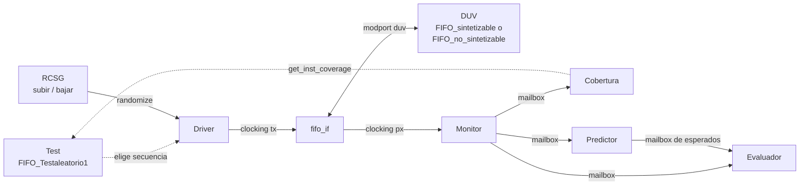

# Verificación de una FIFO síncrona parametrizable

Práctica 1 de **Diseño Microelectrónico Avanzado** (MUISE).
Joan San Bartolomé Ferri y Miquel Àngel Llaneras Gelabert.

Banco de pruebas pre-UVM en SystemVerilog para verificar una FIFO síncrona con reset asíncrono,
borrado síncrono, contador de palabras (`USE_DW`) y flags de vacía y llena. El mismo banco
verifica dos implementaciones:

- `FIFO_no_sintetizable`: el modelo de referencia del profesor, hecho con una cola de SystemVerilog.
- `FIFO_sintetizable`: nuestra FIFO, diseñada a partir del diagrama ASM del enunciado sobre la memoria
  de doble puerto `ram_dp`.

Todo el banco está parametrizado con `WIDTH` (ancho de dato) y `DEPTH` (profundidad), y la FIFO y los
parámetros se eligen al lanzar la simulación, sin tocar el código.

## Resultados

| Comprobación | Resultado |
|---|---|
| FIFO propia, 8×32 | 2550 comparaciones de las cuatro salidas, 0 errores |
| FIFO del profesor, 8×32 | 2550 comparaciones, 0 errores (mismos estímulos) |
| Cobertura funcional | 100 % (141 de 141 bins) en 2550 ciclos |
| Test dirigido del profesor | 96,16 % de cobertura con el covergroup del guion |
| Regresión (2 FIFOs × 8×32, 16×16, 4×64) | 6 de 6 casos con `RESULTADO: EXITO` |
| Inyección de errores | FLAG, ESTADO y DATOIDLE detectados en el flanco siguiente |

La memoria de la práctica explica cada uno de estos resultados con sus capturas.

## Requisitos

- QuestaSim (probado con 2025.1_2 win64) con `vsim` en el PATH.
- Opcional: VS Code, para lanzar todo desde las tareas del proyecto.

## Ejecución rápida

Todo se lanza desde la carpeta `sim/`:

```bash
cd sim
vsim -batch -do "do Comp.do; quit -f"   # 1. compilar
vsim -do Sim.do                         # 2. simular nuestra FIFO (8x32)
vsim -c -do Regresion.do                # 3. regresión completa (compila sola)
```

Cada simulación termina con el informe del scoreboard. La línea que importa es la última:

```
==================== INFORME DEL SCOREBOARD ====================
Transacciones comparadas: 2550
  DATA_OUT    aciertos =   2550   errores =      0
  F_EMPTY_N   aciertos =   2550   errores =      0
  F_FULL_N    aciertos =   2550   errores =      0
  USE_DW      aciertos =   2550   errores =      0
Esperados pendientes de comparar: 1
RESULTADO: EXITO - 2550 comparaciones sin errores
```

Si hay algún error, o si el scoreboard no ha llegado a comparar nada, sale `RESULTADO: FALLO`
como `$error`, así que también aparece en el recuento de errores de QuestaSim.

## Scripts

| Orden | Qué hace |
|---|---|
| `vsim -batch -do "do Comp.do; quit -f"` | Compila los ficheros de `filelist.txt` en `work/` |
| `vsim -do Sim.do` | Test aleatorio sobre nuestra FIFO con 8×32 |
| `vsim -do "set PROFESOR 1; do Sim.do"` | El mismo test sobre la FIFO del profesor |
| `vsim -do "set WIDTH 16; set DEPTH 16; do Sim.do"` | Otros parámetros (se puede combinar con `PROFESOR`) |
| `vsim -do "set top FIFO_tb_v0; do Sim.do"` | Test dirigido del profesor con el covergroup del guion |
| `vsim -do "set ERR FLAG; do SimErr.do"` | Simulación con un error inyectado (ver más abajo) |
| `vsim -c -do Regresion.do` | Las dos FIFOs con 8×32, 16×16 y 4×64 y un resumen final |

`Sim.do` simula hasta el final (`run -all`) y deja el informe HTML de cobertura en
`sim/covhtmlreport/index.html`. Dentro de una sesión de QuestaSim, `reload` recompila y vuelve a
simular con la misma configuración.

`Regresion.do` guarda cada simulación en `sim/reg_<fifo>_<W>x<D>.log` y acaba con este resumen:

```
==================== RESUMEN DE LA REGRESION ====================
  FIFO propia     8 x 32   EXITO - 2550 comparaciones sin errores
  FIFO propia    16 x 16   EXITO - 2000 comparaciones sin errores
  FIFO propia     4 x 64   EXITO - 3200 comparaciones sin errores
  FIFO profesor   8 x 32   EXITO - 2550 comparaciones sin errores
  FIFO profesor  16 x 16   EXITO - 2000 comparaciones sin errores
  FIFO profesor   4 x 64   EXITO - 3200 comparaciones sin errores
=================================================================
```

> Las variables `PROFESOR`, `WIDTH`, `DEPTH` y `top` se quedan definidas en la sesión de QuestaSim.
> Para volver a la configuración por defecto, abre una sesión nueva.

### Tareas de VS Code

Las mismas órdenes están en `.vscode/tasks.json` (`Ctrl+Shift+P` → *Tasks: Run Task*):

| Tarea | Equivale a |
|---|---|
| Compile (`Ctrl+Shift+B`) | `Comp.do` |
| Simulate | `Sim.do` |
| Simulate FIFO profesor | `set PROFESOR 1; do Sim.do` |
| Test dirigido profesor | `set top FIFO_tb_v0; do Sim.do` |
| Simulate con errores | `SimErr.do`, con un desplegable para elegir el modo |
| Regresion | `vsim -c -do Regresion.do` |

Todas compilan antes de simular.

## Inyección de errores

`FIFO_inyeccion_errores.sv` se engancha dentro de `FIFO_sintetizable` con `bind` (solo cuando se usa
`SimErr.do`) y fuerza una señal interna con `force`/`release` en un momento conocido. Sirve para
comprobar que el monitor y el scoreboard detectan fallos de verdad.

| Modo | Error que se fuerza |
|---|---|
| `DATO` | Un bit de `DATA_OUT` invertido en un ciclo con lectura |
| `FLAG` | `F_FULL_N = 0` sin estar llena |
| `USEDW` | `USE_DW` desplazado en +1 |
| `ESTADO` | La FSM salta a `LLENO` con la FIFO a medias |
| `DATOIDLE` | `DATA_OUT` cambia en un ciclo sin lectura ni escritura |

En todos los casos el informe final debe dar `RESULTADO: FALLO`.

## Estructura del repositorio

```
Practicas-DMA/
├── src/
│   ├── FIFO_sintetizable.sv       DUV propio (FSM VACIO/OTROS/LLENO + ram_dp)
│   ├── ram_dp.sv                  Memoria de doble puerto
│   ├── FIFO_no_sintetizable.sv    FIFO de referencia del profesor
│   ├── FIFO_tb_v0.sv              Test dirigido del profesor (+ covergroup del guion)
│   ├── fifo_if.sv                 Interfaz con modports y clocking blocks
│   ├── FIFO_top_duv.sv            Envoltorio del DUV; FIFO_PROFESOR elige la FIFO
│   ├── FIFO_tb.sv                 Top de verificación (reloj, interfaz, DUV y test)
│   ├── utilidades_pkg.sv          Package que incluye todas las clases
│   ├── RCSG_base.sv               Estímulo aleatorio con restricciones de protocolo
│   ├── RCSG_subir.sv              Distribución que llena la FIFO
│   ├── RCSG_bajar.sv              Distribución que vacía la FIFO
│   ├── FIFO_Transaction.sv        Transacción con copy() y clone()
│   ├── FIFO_driver.sv             Driver (reset y secuencias)
│   ├── FIFO_Monitor.sv            Monitor (cobertura, predictor y evaluador)
│   ├── FIFO_Scoreboard.sv         Predictor, evaluador e informe final
│   ├── FIFO_Coverage.sv           Covergroup funcional (sample())
│   ├── FIFO_Enviroment.sv         Entorno: driver + monitor
│   ├── FIFO_Testaleatorio1.sv     Test dirigido por cobertura
│   └── FIFO_inyeccion_errores.sv  Inyector de errores (bind)
├── sim/
│   ├── filelist.txt               Orden de compilación
│   ├── Comp.do                    Compilación
│   ├── Sim.do                     Simulación configurable
│   ├── SimErr.do                  Simulación con inyección de errores
│   ├── Regresion.do               Regresión de las dos FIFOs y tres tamaños
│   └── wave.do                    Señales de la ventana de ondas
└── .vscode/tasks.json             Tareas de VS Code
```

## Cómo está montado el banco



- **Interfaz**: `fifo_if` con los modports `duv`, `driver` y `monitor`. El driver aplica los
  estímulos 2 ns después del flanco (`tx`), el monitor muestrea 1 ns antes (`px`) y el reset
  asíncrono se aplica en el flanco de bajada (`neg_event`).
- **RCSG**: las restricciones impiden leer con la FIFO vacía y escribir con ella llena; las clases
  hijas solo cambian la proporción de lecturas y escrituras.
- **Test**: 1000 ciclos de llenado y 1000 de vaciado, y después ráfagas de 50 ciclos hacia un nivel
  objetivo aleatorio hasta llegar al 100 % de cobertura (o a 10 000 ciclos).
- **Scoreboard**: el predictor modela la FIFO con una cola y deja cada resultado esperado en un
  mailbox; el evaluador lo empareja con la salida real y compara las cuatro salidas en todos los
  ciclos, también en los que no hay operación.

## Notas

- `ram_dp` calcula el ancho de dirección con `$clog2(mem_depth-1)`. Coincide con el de la FIFO para
  profundidades potencia de 2, que son las que usamos.
- La FIFO se elige con el parámetro `FIFO_PROFESOR` de `FIFO_tb` (0 = propia, 1 = profesor), que
  `FIFO_top_duv` usa en un `generate`. En las dos opciones el DUV queda en `/FIFO_tb/duv/g_duv/duv`.

## Créditos

La automatización de QuestaSim desde VS Code (`Comp.do`, `tasks.json`) parte de la plantilla
[VsCodeQuestasim](https://github.com/rgadea-girones/VsCodeQuestasim).
